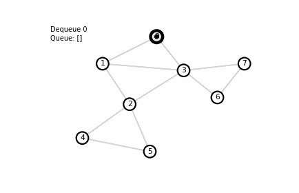

# Graphs

A good workflow:
1. **Model** the problem as a graph (what are nodes? what are edges? directed/undirected? weighted/unweighted?)

- `n` = number of nodes, `m` = number of edges
- Adjacency list representation
- Typical complexity targets: `O(n+m)`, `O(m log n)`, `O(n^2)` depending on constraints
---

## 0. Modeling Patterns

Before algorithms, make sure you’re building the *right* graph.

### Common modeling patterns
- **Grid → graph:** each cell is a node, edges to neighbors (4-dir / 8-dir), walls block edges.
- **State graph (BFS/shortest path on states):** node = (position, extra state) like `(v, mask)` or `(v, parity)`.
- **Constraints → directed edges:** “A must come before B” becomes edge `A -> B`.
- **Equivalence / grouping:** “in the same component” often points to DSU / BFS / DFS.

### Sanity checks
- Directed vs undirected?
- Weighted vs unweighted?
- Is `m` large (up to `2e5`)? Avoid `O(n^2)` methods.
- Are there negative weights? Dijkstra may not apply.
---

## 1. DFS

Depth-First Search explores “as deep as possible” before backtracking.

### Example Use Cases and Common Patterns
- Finding **connected components** (undirected)
- Reachability / flood fill (including grids)
- Detecting cycles - look for back-edge in undirected graphs
- Building DFS orderings (e.g., for SCC or topo via DFS)

### Implementation Notes
- **Visited array** prevents revisits.
- **Parent tracking** can be used to reconstruct paths or build a DFS tree.
- Care for **recursion depth** - especially in python. Simplest implementations are usually recursive however.
- In problems where just the "search" feature is required - that is both DFS and BFS would work, DFS is preferred as the implementation is quicker.

### Complexity
- `O(n + m)` time, `O(n)` memory 

#### Standard Examples:
- [Counting Rooms (CSES)](https://cses.fi/problemset/task/1192)
- [Building Roads (CSES)](https://cses.fi/problemset/task/1666)

---

## 2. BFS

Breadth-First Search explores in increasing distance from a start node (by “levels”).

### When to use
- Shortest path in **unweighted graphs** (each edge cost = 1)
- Finding minimum number of moves on grids
- Multi-source shortest distances (start from many sources at once)
- Layering

### Implementation Notes
- **Queue + dist array**: first time you pop a node, you’ve found the shortest distance.
- **Parent array**: reconstruct the shortest path.

### Complexity
- `O(n + m)` time, `O(n)` memory

#### Standard Examples:
- [Message Route (CSES)](https://cses.fi/problemset/task/1667)

---

### Graph Search Problems:

#### Standard Examples:
- [Building Teams (CSES)](https://cses.fi/problemset/task/1668)
#### Problems:
- [Subarray Sum Constraints (CSES)](https://cses.fi/problemset/task/3294)
- [Palindromic Paths (CF)](https://codeforces.com/group/KIrM1Owd8u/contest/632003/problem/E)
- [Third Avenue (AC)](https://atcoder.jp/contests/abc184/tasks/abc184_e)
- [Olya and Energy Drinks (CF)](https://codeforces.com/contest/877/problem/D)
---
## 3. Shortest Paths

“Shortest path” depends heavily on edge weights.

### Choosing the right tool
- **Unweighted**: BFS
- **Nonnegative weights**: Dijkstra w/ (`priority_queue`)
- **Negative weights but no negative cycles**: Bellman–Ford
- **All-pairs, small n (~500)**: Floyd–Warshall

### Dijkstra (most common)
Works when **all edge weights are >= 0**.
- Maintain `dist[v]` = best known distance
- Use a min-heap priority queue on `(dist, node)`
- Ignore stale heap entries (classic CP trick)

### Complexity
- Dijkstra: `O(m log n)` -> (usually) `O(m log m)` for easier implementation
- Bellman–Ford: `O(nm)`
- Floyd–Warshall: `O(n^3)`

Standard Examples:
- [Shortest Routes I (CSES)](https://cses.fi/problemset/task/1671) (Check Your Dijkstra implementation)
- [Shortest Routes II (CSES)](https://cses.fi/problemset/task/1672) (Check Your Floyd-Warshall implementation)
- [Shortest Routes III (CSES)](https://cses.fi/problemset/task/1673) (Check Your Bellman-Ford implementation)

Problems:
- [Flight Discount (CSES)](https://cses.fi/problemset/task/1195)
- [Fine Dining (USACO)](https://usaco.org/index.php?cpid=861&page=viewproblem2)
---

## 4. Topological Sort

Topological sort orders vertices of a directed acyclic graph (DAG) such that for every edge `(u -> v)`, `u` appears before `v`.

### When to use
- Dependencies / prerequisites
- Scheduling with ordering constraints
- Any problem that forms a DAG and asks for a valid order or DP over dependencies

### Key properties
- Only possible for DAGs (no directed cycles)
- Multiple valid orderings may exist
- Two standard methods:
  - **Kahn’s algorithm (BFS-based):** indegree + queue
  - **DFS finish times:** reverse postorder

### Cycle detection
- Kahn: if you can’t process all nodes, there is a cycle.
- DFS: recursion-stack technique.

Standard Examples:
- [Course Schedule (CSES)](https://cses.fi/problemset/task/1679)

---

## 5. Strongly Connected Components

In a directed graph, an SCC is a maximal set of vertices where every vertex can reach every other.

### When to use
- “Mutual reachability” in directed graphs
- Compressing a directed graph into a DAG of components (condensation graph)
- 2-SAT (classic application)

### Key CP patterns
- SCC compression turns messy directed graphs into a **DAG**, enabling DP/topo solutions.
- Typical algorithms:
  - **Kosaraju:** two DFS passes (on graph and reversed graph)
  - **Tarjan:** one DFS pass with low-link values

### Complexity
- `O(n + m)`

Practice:
- [Planets and Kingdoms (CSES)](https://cses.fi/problemset/task/1683)

---

## 6. Union-Find (Disjoint Set Union, DSU)

DSU maintains a partition of nodes into connected components under merges.

### When to use
- Connectivity under union operations
- Common use case is “How many components?” after each edge addtion
- Can be used to maintain additive properties of components

### Implementation Details
- Use **path compression** + **union by size/rank** for near-constant time.

### Complexity
- Amortized ~ `O(α(n))` per operation (effectively constant)

Practice:
- [Road Construction (CSES)](https://cses.fi/problemset/task/1676)

---

## 7. Minimum Spanning Trees (MST)

Given a connected weighted undirected graph, an MST connects all nodes with minimum total edge weight.

### When to use
- “Connect everything as cheaply as possible”
- Network design / wiring / roads problems
- Often paired with DSU or priority queue

### Two standard algorithms
- **Kruskal:** sort edges by weight, add if it connects two different components (DSU)
  - Great when you already have an edge list and `m` is manageable.
- **Prim:** grow from a start node using a min-heap over frontier edges
  - Great for dense graphs or adjacency-based input.

### Why greedy works (intuition)
MST uses the **cut property**: for any cut, the lightest edge crossing it is safe to take.

### Complexity
- Kruskal: `O(m log m)` (sorting dominates)
- Prim: `O(m log n)` with heap

Practice:
- [Road Reparation (CSES)](https://cses.fi/problemset/task/1675)

---

